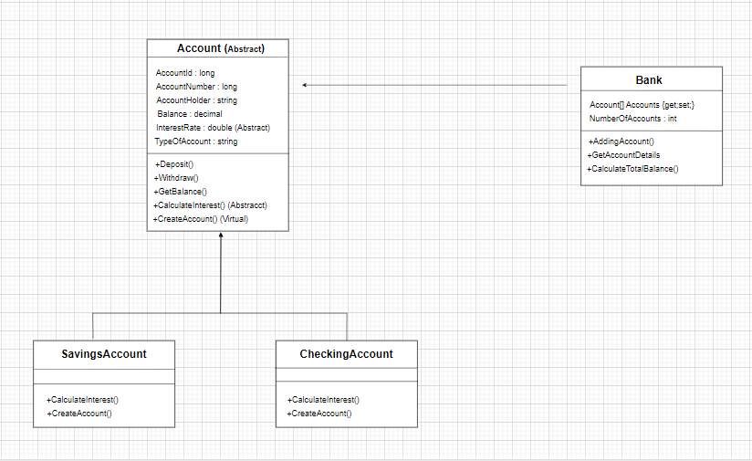

# Banking System Project (C#)

This is an advanced banking system project implemented in C# using Object-Oriented Programming (OOP) principles. The system allows users to create accounts, specify the type of account (checking or savings) using their ID number, and perform various banking operations such as withdrawal, deposit, and balance checking.

## Class Diagram

 

## Features

* Account Creation: Users can create accounts using their unique ID number.
* Account Types: Users can specify whether their account is a checking or savings account during the creation process.
* Login: Users can log in to their accounts using their password and unique ID number.
* Operations:
  * Withdrawal: Users can withdraw funds from their accounts. They are only allowed to withdraw if their account balance is sufficient.
  * Deposit: Users can deposit funds into their accounts.
  * Check Balance: Users can check their account balance.
* Validation: Operations are validated to ensure account balances are sufficient for withdrawals.

 

## Technologies Used

* C#: Implemented using advanced C# programming techniques.
* Object-Oriented Programming (OOP): Utilizes OOP principles such as encapsulation, inheritance, and polymorphism for modular and maintainable code.
* Visual Studio: Developed using Visual Studio IDE for C# development.

 

## How to Use

1- Clone the Repository: Clone the repository to your local machine using Git:
    git clone https://github.com/yourusername/banking-system-csharp.git
2- Open the Project: Open the project in Visual Studio or your preferred C# IDE.
3- Run the Project: Build and run the project from the IDE.
4- Create Account:
  * Provide your ID number.
  * Specify the type of account (checking or savings).
5- Login:
  * Use your password and unique ID number to log in.
 
6- Perform Operations:
 * Choose from withdrawal, deposit, or check balance options.
 * Follow the prompts to complete the operation.

   

  ## Contributing

  Contributions are welcome! If you have any suggestions, improvements, or feature requests, please open an issue or submit a pull request.

   

  ## License

  This project is licensed under the MIT License.

